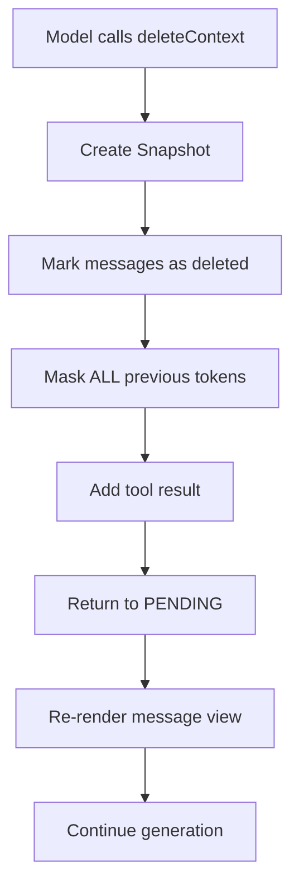

# StateLM Quick Start Guide

## ✅ Implementation Complete!

All StateLM features have been successfully implemented in `tool_agent_loop.py`. The verification script confirms all components are working correctly.

## 🚀 Quick Start

### Step 1: Update Your Configuration

Add these lines to your config file:

```yaml
actor_rollout_ref:
  rollout:
    max_model_length: 8192  # Adjust based on your model
    multi_turn:
      statelm_enabled: true
      context_length_penalty: -1.0
```

### Step 2: Prepare Your Data

Ensure your dataset includes `document_content`:

```python
data_item = {
    "raw_prompt": [{"role": "user", "content": "Your question"}],
    "document_content": "Your long document here...",
    "extra_info": {...},
    "tools_kwargs": {...}
}
```

### Step 3: Run Training

```bash
python your_training_script.py --config your_config.yaml
```

## 📚 Documentation

- **STATELM_IMPLEMENTATION.md**: Detailed technical documentation
- **STATELM_CHANGES_SUMMARY.md**: Code changes and modifications
- **STATELM_USAGE_EXAMPLE.md**: Usage examples and scenarios
- **verify_statelm.py**: Verification script (already run successfully)

## ✨ Key Features Implemented

### 1. Conversation History Management
- ✅ Persistent `full_history` tracking
- ✅ Message ID assignment and tracking
- ✅ Deleted message management
- ✅ Message rendering with stub replacement

### 2. Document Context Handling
- ✅ Separate `document_content` storage
- ✅ Tool-based document interaction
- ✅ Not directly visible in messages

### 3. Trajectory Snapshots
- ✅ Automatic snapshot on `deleteContext`
- ✅ Preserves full trajectory state
- ✅ Includes: prompt_ids, response_mask, history, etc.

### 4. Masking Strategy
- ✅ Normal: Tool results masked (0), assistant responses unmasked (1)
- ✅ After delete: ALL previous tokens masked (0)
- ✅ Clean gradient flow for learning

### 5. Context Length Protection
- ✅ Pre-generation length check
- ✅ Early termination with penalty
- ✅ Prevents training crashes

### 6. Emission Views & Turn Boundaries
- ✅ Tracks prompt snapshots per turn
- ✅ Records assistant turn positions
- ✅ Enables causal log-probability computation

### 7. DeleteContext Tool
- ✅ Internal handling (no external tool needed)
- ✅ Accepts message IDs to delete
- ✅ Triggers snapshot + masking + re-rendering
- ✅ Returns to PENDING state for fresh context

## 🎯 What Happens During deleteContext



## 🔍 Monitoring & Debugging

### Check Metrics

After running, check these metrics in the output:

```python
output.metrics = {
    "context_length_exceeded": bool,  # True if trajectory exceeded max length
    "early_stop_penalty": float,      # Penalty applied if exceeded
    # ... other metrics
}
```

### Inspect Snapshots

Access trajectory snapshots for debugging:

```python
agent_data.trajectory_snapshots  # List of snapshots before each delete
agent_data.deleted_msg_ids       # Set of deleted message IDs
agent_data.emission_views        # Prompt snapshots per turn
```

### Verify Masking

```python
# Normal turn: [1,1,1,1,0,0,0,1,1,1,0,0,0]
#              ^^^^^^^^^       ^^^^^^^
#              assistant       assistant (tool results are 0)

# After delete: [0,0,0,0,0,0,0,0,0,0,0,0,0]
#               ^^^^^^^^^^^^^^^^^^^^^^^^^^^^^
#               ALL masked (no loss computed)
```

## ⚠️ Important Notes

1. **Backward Compatible**: When `statelm_enabled=False`, works as before
2. **No External Tool Definition**: `deleteContext` is handled internally
3. **Snapshot Overhead**: Deep copies on each delete (expected and necessary)
4. **Conservative Masking**: Masks everything after delete to ensure clean training

## 🧪 Testing Checklist

Before production use:

- [ ] Test with `statelm_enabled=False` (backward compatibility)
- [ ] Test with `statelm_enabled=True` and small dataset
- [ ] Verify context length protection triggers correctly
- [ ] Check deleteContext creates snapshots
- [ ] Verify masking behavior (normal vs after-delete)
- [ ] Test with trajectories that exceed `max_model_length`
- [ ] Monitor emission views and turn boundaries
- [ ] Validate document_content parameter passing

## 📊 Performance Considerations

- **Snapshot Creation**: O(n) where n is trajectory length (only on delete)
- **Message Rendering**: O(m) where m is number of messages (only before generation)
- **Context Check**: O(1) before each generation (minimal overhead)

## 🐛 Troubleshooting

### Issue: Context length exceeded frequently
**Solution**: Increase `max_model_length` or encourage model to delete earlier

### Issue: Masking not working
**Solution**: Verify `statelm_enabled=True` in config

### Issue: deleteContext not detected
**Solution**: Check tool call format matches expected schema

### Issue: Training crashes with long documents
**Solution**: Ensure context length protection is enabled

## 📞 Support

For issues or questions:
1. Check the detailed documentation in `STATELM_IMPLEMENTATION.md`
2. Review code changes in `STATELM_CHANGES_SUMMARY.md`
3. See examples in `STATELM_USAGE_EXAMPLE.md`
4. Run `python verify_statelm.py` to verify implementation

## 🎉 Summary

You now have a fully functional StateLM implementation that:
- Manages editable conversation history
- Handles document context via tools
- Creates trajectory snapshots
- Implements sophisticated masking
- Protects against context overflow
- Tracks emission views for causal RL

Happy training! 🚀

